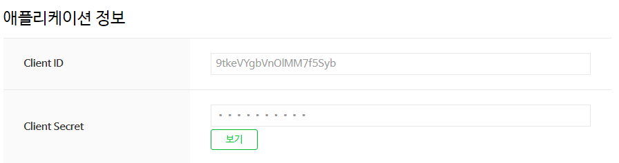

## OAuth 2.0

### 용어 정리

User : 사용자  
Mine : 내 서비스 (개발자의 운영 서비스)  
Their : 구글 페이스북 트위터 등 타 서비스(OAuth2.0 제공 서비스)

이렇게 3가지의 일반적인 용어를 OAuth 에서는 사용하지 않는다.  
그럼 각각의 용어가 어떻게 바뀌는지 한번 알아보자

Their ▶ Resource Server  
페이스북 구글 등 우리가 **제어하고자 하는 자원**(소셜 로그인 정보)를 **가지고 있는 곳** 이라는 의미로 Resource Server

User ▶ Resource Owner  
사용자는 제어하고자 하는 정보의 소유자 라는 의미로 Resource Owner 가 된다.

Mine ▶ Client
우리의 서비스가 리소스 서버에서 자원을 가져오는 역할을 가짐으로 클라이언트 라고 부른다.

✅ 공식 문서를 보면 Authorization Server 가 존재한다. Authrization은 즉 권한을 부여하는 서버로 정보를 가진 서버 그리고 권한 부여를 하는 서버를 분리한다  
하지만 일단 이부분을 Resource 서버로 통합해서 생각

> 여기서 많은 사람들이 우리의 서비스가 클라이언트가 되고 갑자기 기존의 클라이언트 즉 우리 서비스의 고객이 Resource Owner 가 되는 용어의 급격한 변경으로 인해서 개념적으로 접근하지 어렵게 느껴질 수 있다.

용어 정리를 통한 접근 사고의 전환을 먼저 항상 가지자

### OAuth 2.0 등록

우리는 OAuth 2.0 을 사용하는 주요 목적은 민감한 사용자의 정보를 타 서비스를 통해서 관리하는데 있다  
그러기 위해서 우리는 먼저 타 서비스 즉 Resource Server에 우리 서비스에 대한 정보를 등록해야 한다.

모든 서비스가 각각 개발자 센터 또는 다른 방법을 통해서 이 등록 절차를 수행한다.
하지만 공통적으로 **3가지의 정보**를 가진다.

1. Client ID : 노출 가능
2. Client Secret : 노출 절대 불가능
3. Authorized Redirect URI

우리는 국내에서 많이 사용하는 네이버를 기준으로 하겠다.

1. 네이버 개발자 센터에서 어플리케이션 등록 및 네이버 로그인을 선택
   

2. 서비스의 URL 와 Authorized Redirect URI 설정
   

3. 어플리케이션 등록 및 정보 확인
   

이렇게 3단계의 과정만 진행하면 쉽게 OAuth를 위한 3가지의 정보를 취득 가능하다.  
이 과정이 바로 Resource Server에 Client 를 Register 한 것이다.
